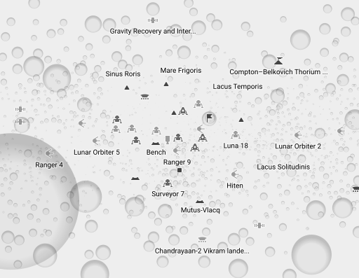

Open Moon Map
=============

Small research project on using OpenStreetMap XML format to create open map of
Moon and displaying this data with [Röntgen](https://github.com/enzet/Roentgen).

Idea from
[Mapping the Moon](https://wiki.openstreetmap.org/wiki/Mapping_the_Moon) wiki
page.

Install
-------

**Requirements**: Python 3.9.

```bash
pip install -r requirements.txt
```

Get your own open Moon map
--------------------------



### Construct OSM XML file ###

Request objects on the surface of the Moon (Wikidata id
[Q405](https://www.wikidata.org/wiki/Q405)) Wikidata through SPARQL, parse
results into an OSM XML file `moon.osm` file.

```bash
python omm --body 405 --output moon.osm
```

### Draw map with Röntgen ###

Using Röntgen one can draw SVG map `moon.svg`:

```bash
roentgen render \
    --input moon.osm \
    --output moon.svg \
    --zoom-level 2 \
     --equator-length 10917000.0
```

or construct tiles for interactive map and run it:

1. Draw tiles for zoom levels 0—4: `roentgen tile -i moon.osm -z 0-4`.
2. Run Röntgen tile server: `roentgen server`.
3. Open `data/leaflet.html` in browser.